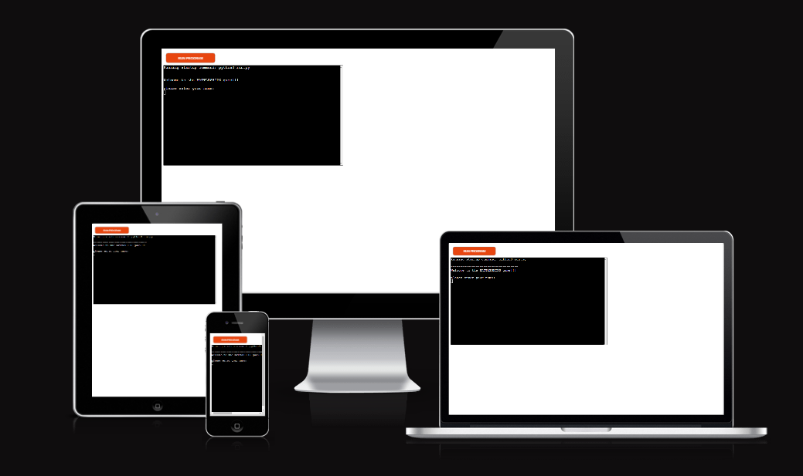
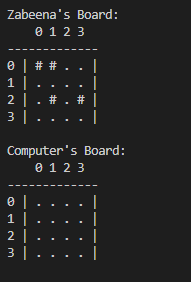
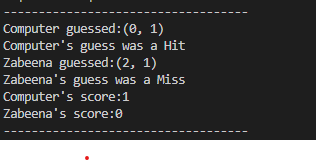

# BATTLESHIPS
BATTLESHIPS is a Python terminal game, which runs in Code institute mock terminal on Heroku.
Players can try ro beat the computer by finding all of the computer's battleships before the computer finds theirs, each battleship occupies one square on the board.
[The live project can be found here.](https://battle-ship-zabeena.herokuapp.com/)

Game preview on different devices:

## How to Play
BATTLESHIPS is based on the classic pen-and-paper game.
In this version, the player enters their name and two boards are randomly generated.
The player can see where their ships are, indicated by an # sign, but cannot see where the computer's ships are.
Guesses are marked on the board with an X. Hits are indicated by *. 
The player and the computer then take it in to make guesses and try to sink each other's battlesships.
The winner is the player who sinks all of their opponent's battleships first.
## Features

* ### Random board generation
    * Ships are randomly placed on both the player and computer boards
    * The player cannot see where the computer's ships are
    
* ### Play against the computer
* ### Accepts user input
* ### Keep track of scores

* ### Input Validation and Error Checking
    * You cannot input any other word in place of level
    * You cannot enter coordinates outside the size of the board
    * You must enter numbers
    * You can not enter the same guess twice

* ### Data maintained in class instances

## Data Model

I decided to use a Board class as my model. The game creates two instances of the Board class to hold player's and the computer's board
The Board class stores the board size, the number of ships, the guesses against that board and details such as the board type(player's board or computer) and the player's name.
The class has also methods to help play game, such as a print method to print out the current add_ships methods to add ships to the board and an  add_guess method to add a guess and return the result.
## Testing

* Continuous testing was carried out throughout the development process with errors corrected as they appeared.
* The Gitpod in built problem reporting also helped to identify problems when they arose.
* Given invalid inputs: strings when numbers are excepted, out of bounds inputs, same input twice
* Tested in my local terminal and the Code institute Heroku terminal.

### Validator Testing
* Haven't validate it in  [PEP8 online check.](http://pep8online.com/) Cause I couldn't figure out how the website works.

## Deployment

### Heroku

The project was deployed using the Code Institute mock terminal for Heroku. The following steps can be used to deploy the site:
* Navigate to GitHub locate and fork or clone the GitHub repository.
* Navigate to and login to Heroku.
* From the dashboard select 'New' and 'Create new app'.
* Give the app a name (the name must be unique) and click 'Create app'.
* Navigate to the settings tab and select 'Add buildpack'.
* Search for and select the 'Python' and 'NodeJS buildpacks in that order.
* Navigate to the 'Deploy' tab and choose GitHub as the deployment method.
* Search for and select the correct GitHub repository.
* Select either automatic of manual deployment.

## Credits

* Code Institute provided the template for the deployment terminal.
* Most of the code for the Board class was taken from PP3 scope video
* Most of the text in readme is from the sample of readme in PP3 assesment critera module. 
* All other codes are written by myself